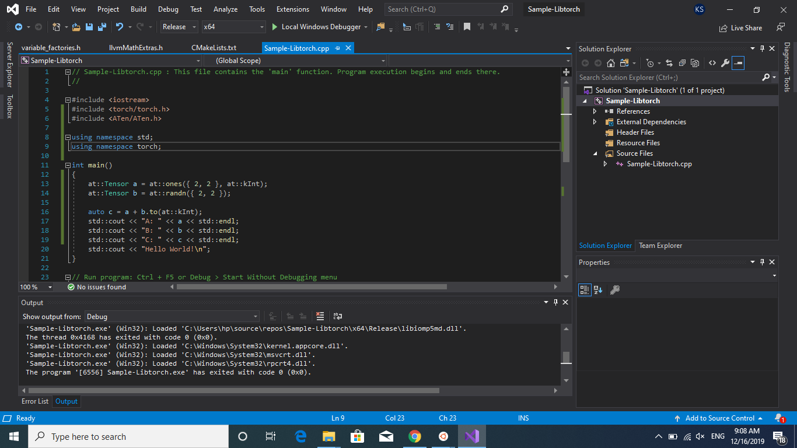

## Setting up Libtorch on Windows

1. **Use this Medium Blog:** https://medium.com/@boonboontongbuasirilai/building-pytorch-c-integration-libtorch-with-ms-visual-studio-2017-44281f9921ea
2. **Error C4146:**
    * **Error received:** https://github.com/pytorch/pytorch/issues/29654
    * **Solution:** https://github.com/pytorch/pytorch/pull/27596

## Additional Instructions

1. Copy all files to the build directory from `lib/` folder. (If not, error of `torch.dll` not found will come).
2. `caffe2.lib` not found. Remove from the *Linker -> Input* list.

## Screenshots

Example of code working

